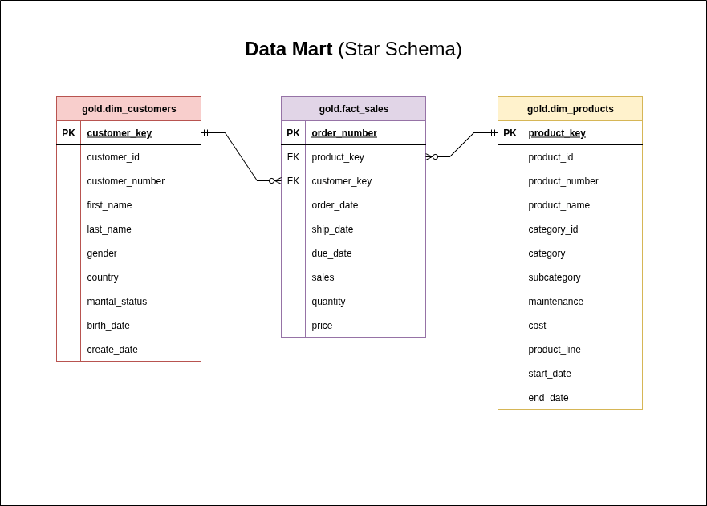

# Data Warehouse Project

A comprehensive data warehouse implementation following the modern medallion architecture (Bronze-Silver-Gold) using PostgreSQL. This project demonstrates best practices for data ingestion, transformation, and analytics-ready data modeling.

*Following video by Data with Baraa: https://www.youtube.com/watch?v=9GVqKuTVANE*

## 📋 Project Overview

This data warehouse project implements a complete ETL (Extract, Transform, Load) pipeline that processes data from multiple source systems (CRM and ERP) through a three-layer architecture:

- **Bronze Layer**: Raw data ingestion with minimal processing
- **Silver Layer**: Cleaned and validated data with business rules applied
- **Gold Layer**: Analytics-ready dimensional model for reporting and BI

The project handles sales data, customer information, and product catalogs from different business systems, creating a unified view for business intelligence and reporting purposes.

## 🏗️ Data Architecture




## 🔧 Requirements

### System Requirements

- **Database**: PostgreSQL 12+ (primary database engine)
- **Operating System**: Linux/macOS/Windows
- **Memory**: Minimum 4GB RAM recommended
- **Storage**: At least 1GB free space

### Technical Dependencies

- PostgreSQL server with appropriate permissions for:
  - Creating schemas and tables
  - Loading data from CSV files
  - Creating functions and procedures
- CSV data files accessible to PostgreSQL server

### Access Requirements

- Database user with permissions to:
  - CREATE/DROP schemas
  - CREATE/DROP tables and views
  - INSERT/UPDATE/DELETE data
  - Execute functions

## 📁 Repository Structure

```
data-warehouse/
├── README.md                          # Project documentation
├── Datasets/                          # Source data files
│   ├── source_crm/                    # CRM system exports
│   │   ├── cust_info.csv             # Customer information
│   │   ├── prd_info.csv              # Product information
│   │   └── sales_details.csv         # Sales transactions
│   └── source_erp/                    # ERP system exports
│       ├── CUST_AZ12.csv             # Customer demographics
│       ├── LOC_A101.csv              # Customer locations
│       └── PX_CAT_G1V2.csv           # Product categories
├── Scripts/                           # SQL scripts for ETL pipeline
│   ├── create_layers.sql             # Schema creation script
│   ├── Bronze/                        # Bronze layer (raw data)
│   │   ├── ddl.sql                   # Table definitions
│   │   └── load.sql                  # Data loading functions
│   ├── Silver/                        # Silver layer (cleaned data)
│   │   ├── ddl.sql                   # Table definitions
│   │   └── load.sql                  # Data transformation functions
│   └── Gold/                          # Gold layer (dimensional model)
│       ├── create_dim_customers.sql   # Customer dimension
│       ├── create_dim_products.sql    # Product dimension
│       └── create_fact_sales.sql      # Sales fact table
├── Tests/                             # Data quality tests
│   ├── test_silver.sql               # Silver layer validation
│   └── test_gold.sql                 # Gold layer validation
└── docs/                              # Documentation and diagrams
    ├── data-flow-diagram.png         # Visual data flow
    ├── data-mart.png                 # Data mart design
    ├── integration-model.png         # Integration architecture
    └── diagrams.drawio               # Editable diagrams
```

### Key Components

#### Bronze Layer

- **Purpose**: Raw data storage with minimal transformation
- **Data Sources**: CRM and ERP CSV files
- **Processing**: 1:1 copy from source files
- **Tables**: Direct replicas of source system structures

#### Silver Layer

- **Purpose**: Cleaned and validated business data
- **Processing**: Data quality improvements, standardization, deduplication
- **Features**: 
  - Data type standardization
  - Null value handling
  - Referential integrity validation
  - Business rule application

#### Gold Layer

- **Purpose**: Analytics-ready dimensional model
- **Design**: Star schema with dimensions and facts
- **Components**:
  - `dim_customers`: Customer dimension with demographics and location
  - `dim_products`: Product dimension with categories and attributes
  - `fact_sales`: Sales fact table with measures and foreign keys

## 🚀 Getting Started

### 1. Database Setup

```sql
-- Connect to PostgreSQL and create the schemas
\i Scripts/create_layers.sql
```

### 2. Bronze Layer Setup

```sql
-- Create bronze tables and load raw data
\i Scripts/Bronze/ddl.sql
\i Scripts/Bronze/load.sql
```

### 3. Silver Layer Processing

```sql
-- Create silver tables and process cleaned data
\i Scripts/Silver/ddl.sql
\i Scripts/Silver/load.sql
```

### 4. Gold Layer Creation

```sql
-- Create dimensional model
\i Scripts/Gold/create_dim_customers.sql
\i Scripts/Gold/create_dim_products.sql
\i Scripts/Gold/create_fact_sales.sql
```

### 5. Data Quality Testing

```sql
-- Run validation tests
\i Tests/test_silver.sql
\i Tests/test_gold.sql
```

## 🔍 Data Quality Features

- **Duplicate Detection**: Identifies and handles duplicate records
- **Data Standardization**: Consistent formatting across all layers
- **Referential Integrity**: Ensures valid relationships between tables
- **Null Value Handling**: Appropriate defaults and validations
- **Data Type Conversion**: Proper typing for dates, numbers, and strings
- **Business Rules**: Applied consistently across transformations

## 📊 Usage Examples

### Customer Analysis

```sql
SELECT 
    country,
    gender,
    COUNT(*) as customer_count
FROM gold.dim_customers
GROUP BY country, gender
ORDER BY customer_count DESC;
```

### Product Sales Performance

```sql
SELECT 
    p.category,
    p.subcategory,
    SUM(f.sales) as total_sales,
    COUNT(*) as order_count
FROM gold.fact_sales f
JOIN gold.dim_products p ON f.product_key = p.product_key
GROUP BY p.category, p.subcategory
ORDER BY total_sales DESC;
```

## 📰 License

Distributed under the [MIT License](LICENSE).
